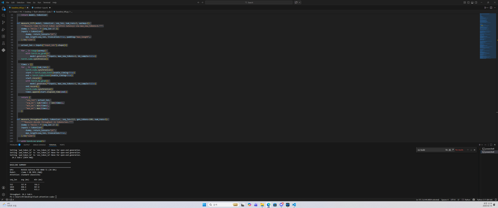

# FlashAttention CUDA Kernel

Custom FlashAttention forward kernel implemented from scratch in CUDA, targeting Llama 3 8B inference on consumer/edge GPUs.

## Overview

This project implements the tiled FlashAttention algorithm ([Dao et al., 2022](https://arxiv.org/abs/2205.14135)) as a standalone CUDA kernel. The kernel avoids materializing the full N×N attention score matrix in global memory by computing attention in tiles using on-chip shared memory, with online softmax for numerical stability.

**Target hardware:** NVIDIA RTX 4060 Ti (8GB) → Jetson AGX Orin (64GB unified)

## Key Results

| Metric | Value |
|--------|-------|
| Correctness | ALL PASSED (max_err < 0.001 vs PyTorch SDPA) |
| Speedup (n=2048) | **2.26x** over naive attention |
| DRAM Throughput | **~1.5%** of peak (tiling keeps data on-chip) |
| Baseline TTFT (n=2048) | 934 ms → target for optimization |

### Benchmark (bh=32, d=128, RTX 4060 Ti)

| seq_len | naive (ms) | flash (ms) | speedup |
|---------|-----------|-----------|---------|
| 512 | 26.2 | 29.9 | 0.87x |
| 1024 | 231.3 | 119.2 | 1.96x |
| 2048 | 1800.4 | 461.7 | **2.26x** |

> At short sequences (512), tiling overhead dominates. The benefit scales with sequence length due to O(N²) → O(N) DRAM access reduction.

### Baseline TTFT (Llama 3 8B INT4 AWQ, standard attention)

| seq_len | TTFT (ms) |
|---------|-----------|
| 512 | 317.0 |
| 1024 | 468.6 |
| 2048 | 934.3 |
| Decode throughput | 24.1 tok/s |

### Evidence

<details>
<summary>Baseline TTFT measurement (click to expand)</summary>


</details>

<details>
<summary>Kernel correctness + benchmark (click to expand)</summary>


</details>

## Architecture

### Kernel Design

```
Tile config (Llama 3, head_dim=128):
  Br = 64, Bc = 64
  Shared memory: ~96.5 KB / 128 KB available

Shared memory layout:
  sQ:    Br × D   (FP16)  = 16 KB    ← loaded once per block
  sK:    Bc × D   (FP16)  = 16 KB    ← streamed per K/V tile
  sV:    Bc × D   (FP16)  = 16 KB    ← streamed per K/V tile
  sS:    Br × Bc  (FP32)  = 16 KB    ← scores, never written to DRAM
  sO:    Br × D   (FP32)  = 32 KB    ← output accumulator
  m, l:  Br each  (FP32)  = 0.5 KB   ← online softmax state
```

### Algorithm

1. Load Q tile into shared memory (once per block)
2. For each K/V tile:
   - Load K, V into shared memory
   - Compute S = Q @ K^T × scale in shared memory
   - Online softmax: update running max and sum
   - Accumulate O += softmax(S) @ V
3. Normalize O by softmax denominator
4. Write back to global memory

The N×N score matrix **never exists in global memory**. This is the core memory saving.

## Files

| File | Description |
|------|-------------|
| `flash_attention.cu` | CUDA kernel: tiled FlashAttention + naive baseline |
| `test_flash_attention.py` | Correctness test, benchmark, DRAM analysis |
| `baseline_ttft.py` | End-to-end TTFT measurement with Llama 3 8B AWQ |
| `ncu_result.csv` | Nsight Compute profiling data |
| `troubleshooting_log.md` | Dependency issues and solutions |

## Setup

### Requirements

```
Python 3.11
CUDA 12.1
PyTorch 2.3.1+cu121
transformers==4.45.0
autoawq==0.2.6
autoawq-kernels==0.0.7
numpy<2
```

### Build & Run

CUDA kernel compilation requires MSVC (Windows) or GCC (Linux):

```bash
# Windows: open "x64 Native Tools Command Prompt for VS 2022"
cd flash-attention-cuda

# Run correctness + benchmark
python test_flash_attention.py

# Run baseline TTFT measurement (downloads ~4GB model on first run)
python baseline_ttft.py
```

### Nsight Compute Profiling

```bash
# CLI
ncu --set full --kernel-name flash_attn_fwd_kernel python test_flash_attention.py

# CLI with CSV output
ncu --set full --kernel-name flash_attn_fwd_kernel --csv python test_flash_attention.py > ncu_result.csv
```

## Profiling Results (Nsight Compute)

| Metric | Value |
|--------|-------|
| Occupancy | 8.34% (limited by shared memory) |
| DRAM Throughput | ~1.5% of peak |
| Memory Throughput | 20-86% (shared memory active) |
| Block Size | 128 threads |
| Shared Memory / Block | 98.8 KB (dynamic) |
| Registers / Thread | 40 |

**Key insight:** The low DRAM throughput confirms the kernel operates almost entirely from on-chip SRAM. The 95% uncoalesced shared memory access warning indicates optimization opportunity via bank conflict reduction.

## Optimization Opportunities

- [ ] Shared memory bank conflict reduction (swizzling)
- [ ] Warp-level primitives (`__shfl_sync`) for row max/sum
- [ ] Async global→shared copy (`cp.async` on SM 80+)
- [ ] Double buffering for K/V tile loads
- [ ] Causal masking support

## Hardware Notes

| | RTX 4060 Ti | Jetson AGX Orin |
|---|------------|----------------|
| Architecture | Ada Lovelace (SM 8.9) | Ampere (SM 8.7) |
| DRAM | GDDR6 288 GB/s | LPDDR5 204.8 GB/s |
| L1/Shared | 128 KB per SM | 128 KB per SM |
| SMs | 34 | 16 |
| Compile flag | `-arch=sm_89` | `-arch=sm_87` |

Both GPUs share 128 KB shared memory per SM, making the kernel directly portable with only a compile flag change.

## References

- [FlashAttention: Fast and Memory-Efficient Exact Attention with IO-Awareness](https://arxiv.org/abs/2205.14135) (Dao et al., 2022)
- [FlashAttention-2: Faster Attention with Better Parallelism and Work Partitioning](https://arxiv.org/abs/2307.08691) (Dao, 2023)
- [NVIDIA CUDA C++ Programming Guide](https://docs.nvidia.com/cuda/cuda-c-programming-guide/)
